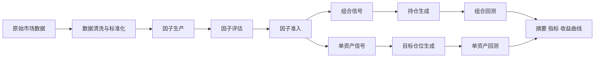
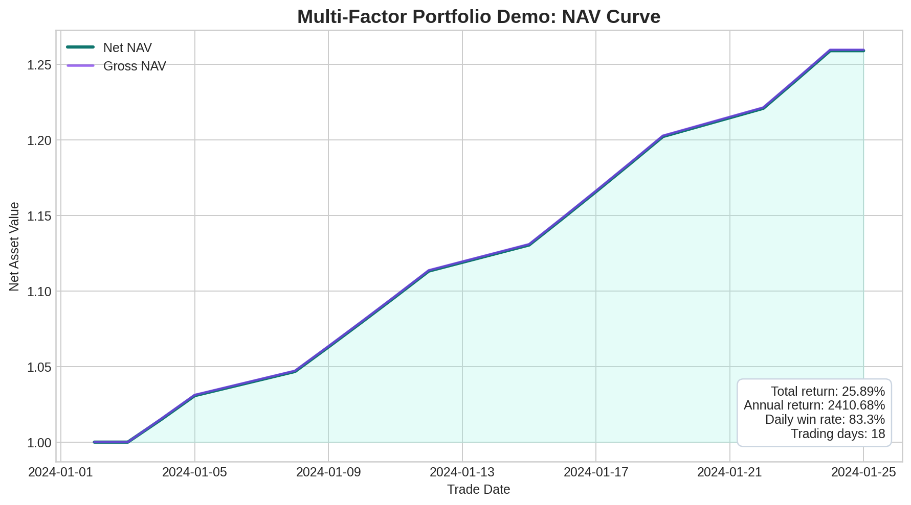
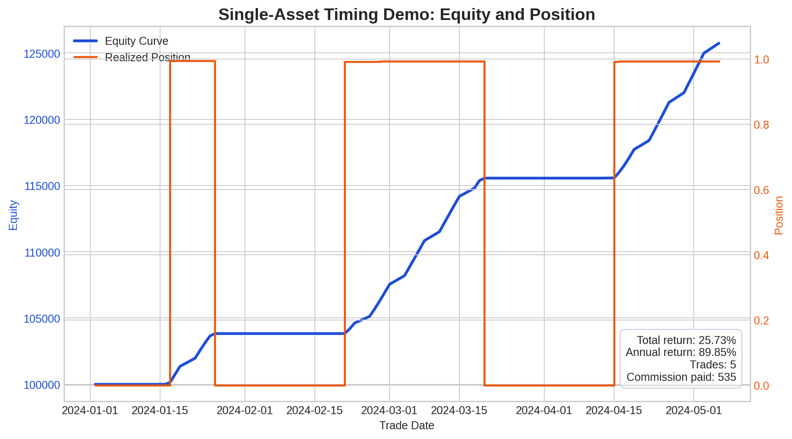
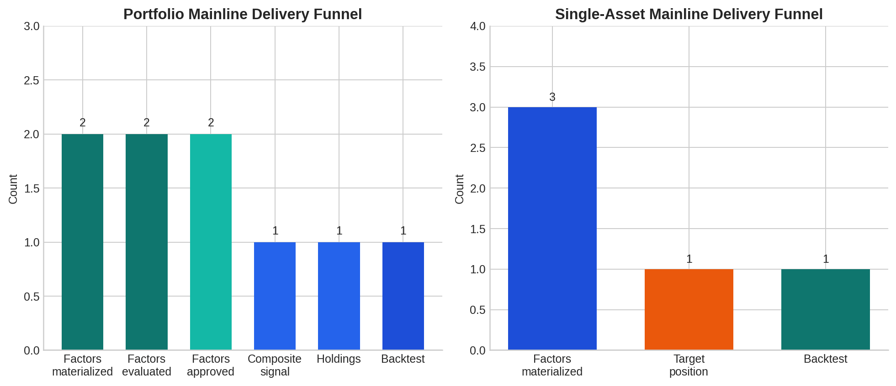

# 面向产品经理的项目总览

这份文档不是给工程师看的开发说明，而是给产品经理、项目负责人和业务同学看的“项目地图”。

如果只用一句话概括这个项目：

这是一个量化研究中后台，用来把市场数据一步步加工成因子、策略、持仓或仓位，再通过回测把结果变成可展示、可比较、可沉淀的研究资产。

它现在更像“策略生产工厂”和“研究资产管理后台”，而不是一个已经完成前台包装的投资产品。

---

## 1. 一页结论

### 这个项目已经能做什么

目前项目已经能打通两条主流程：

1. 多因子组合流程
2. 单资产择时流程

两条流程都已经可以从输入数据一路跑到回测结果，并产出标准化的摘要文件、收益曲线、指标表和中间结果。

### 这个项目最适合被做成什么产品

从产品视角看，它最适合支撑下面几类页面或系统：

1. 因子评估页
2. 因子准入审批页
3. 策略卡片页
4. 回测结果页
5. 研究资产目录页

### 这个项目目前还不是什么

它目前还不是：

1. 实盘交易系统
2. 面向终端投资者的 App
3. 已经统一 API 化的在线服务

当前更适合的理解方式是：

研究团队先在这里生产标准化结果，再由上层页面、中间层服务或前端系统去读取和展示这些结果。

---

## 2. 先解释几个金融词，但尽量不讲术语堆

| 词 | 用大白话解释 |
| --- | --- |
| 因子 | 一种“打分规则”，用来判断某个标的更可能涨、跌，或者更值得持有 |
| 因子评估 | 检查这个打分规则到底有没有预测力 |
| IC / RankIC | 看“打分高低”和“未来收益高低”是不是一致；越稳定，说明因子越靠谱 |
| 准入 | 因子评估完以后，决定它能不能进入下一步策略组合 |
| 信号 | 因子进一步加工后的“动作建议”，例如偏多、偏空、减仓、加仓 |
| 持仓 / 目标仓位 | 最终落实成“买什么、买多少” |
| 回测 | 用历史数据模拟这套策略过去如果运行，会得到什么结果 |
| 回撤 | 从高点掉下来最多掉了多少，是风险感受最直观的指标之一 |

如果把整个项目类比成消费互联网产品链路，它有点像：

原始数据层是“内容供给”，因子层是“推荐算法候选池”，策略层是“排序与决策层”，回测层是“离线效果评估系统”。

---

## 3. 这个项目的完整流程

### 每一层在业务上分别做什么

| 层 | 对产品经理意味着什么 |
| --- | --- |
| 数据层 | 提供稳定的市场数据原料 |
| 数据清洗层 | 把不同来源、不同格式的数据整理成下游可直接消费的统一格式 |
| 因子层 | 负责产生、评估和筛选“有解释力的信号来源” |
| 策略层 | 把因子变成真正可执行的投资动作 |
| 回测层 | 用统一口径告诉我们策略历史表现如何 |
| Demo 层 | 把整条流程包装成可运行、可展示、可验证的样板间 |

### 最终会沉淀出哪些可以被产品消费的结果

从 PM 角度，不必盯住代码，盯住结果产物就够了。当前项目最关键的结果产物主要有四类：

1. 摘要类：例如 pipeline summary、策略 summary
2. 指标类：例如收益率、夏普、回撤、换手、胜率
3. 曲线类：例如净值曲线、收益曲线、仓位变化
4. 明细类：例如信号、持仓、目标仓位、因子面板

## 3.1 数据清洗模块在做什么

很多非技术同学会天然以为：

有了市场数据，就可以直接算因子。

但量化项目里，真正的问题往往出在数据“能不能对齐、能不能比较、能不能稳定复用”。

所以数据清洗模块的作用不是“再做一份数据”，而是把原始数据变成更可信、更适合研究和回测的数据底座。

当前入口：

- [raw_data_layer/raw_data_cleaning/README.md](raw_data_layer/raw_data_cleaning/README.md)

### 它解决的业务问题

如果没有这层，常见问题会是：

1. 同一个标的在不同数据源里名字不一致
2. 时间字段格式不一致，导致日度、分钟级数据对不上
3. 重复记录、空值记录混进来，导致因子结果失真
4. 上游数据能看，但下游策略和回测没法直接吃

所以这层的本质是：

把“原始数据可下载”升级成“研究数据可复用”。

### 它的工作方式

这层当前主要做下面几件事：

1. 按不同数据源分别清洗，而不是粗暴拼成一张大表
2. 统一标准字段，例如 ticker、时间、主键
3. 过滤掉空 ticker、空时间、重复记录等脏数据
4. 尽量保留原始业务字段，方便后面继续做因子研究
5. 输出一份清洗运行摘要，记录清洗前后行数和问题情况

对 PM 来说，可以把它理解成“数据入库质检层”。

### 为什么这层对产品也很重要

它虽然不直接产出漂亮图表，但它决定了：

1. 因子评估结果是不是可信
2. 策略卡片里的指标是不是稳定
3. 同一条策略下次重跑时，结果会不会飘
4. 多个页面能不能共享同一套字段口径

如果以后做产品页面，这层最适合支持的不是交易图，而是：

1. 数据质量状态页
2. 数据源覆盖率页
3. 清洗任务运行页
4. 数据可用性监控页

### 这层会产出什么

从结果角度看，它最重要的产出有两类：

1. cleaned parquet，也就是已经标准化过的研究底层数据
2. `_cleaning_run_summary.json`，也就是一次清洗任务的摘要和质检报告

这意味着它已经具备被产品化成“数据运营后台”的基础。

## 3.2 因子模块的全流程

如果说整个项目最核心的业务价值在哪，答案通常就是因子模块。

因为因子模块决定了：

这个系统能不能持续地产生“有研究价值的信号”，而不是只会做回测展示。

当前因子模块不是单一目录，而是一整条链：

1. 因子生产
2. 因子评估
3. 因子准入
4. 下游进入策略层

对应入口主要在：

- [factor_layer/README.md](factor_layer/README.md)
- [factor_layer/factor_engine/README.md](factor_layer/factor_engine/README.md)
- [factor_layer/factor_evaluation/README.md](factor_layer/factor_evaluation/README.md)
- [factor_layer/factor_admission/README.md](factor_layer/factor_admission/README.md)

### 第一步：因子生产

这一阶段解决的问题是：

“我们准备如何给资产打分？”

这里的打分可以来自很多金融逻辑，例如：

1. 动量：最近涨得强不强
2. 反转：涨太快会不会回落，跌太多会不会反弹
3. 质量：财务质量好不好
4. 规模或估值：是不是更便宜、或者更稳健
5. 量价结构：成交量、波动率和价格的关系有没有异常

在系统里，这一步主要由 `factor_engine` 完成。

对 PM 来说，它的意义不是“写表达式”，而是：

系统已经可以把一个研究想法标准化成一条可重复运行的因子生产规则，并把结果沉淀到 factor lake。

所谓 factor lake，可以简单理解成：

一个专门存放因子结果的“中间资产库”。

### 第二步：因子评估

因子生产出来以后，不能直接进入策略。

必须先回答一个更关键的问题：

“这个因子真的有用吗？”

这一步主要由 `factor_evaluation` 完成，当前会产出：

1. IC / RankIC
2. 不同 horizon 的评估摘要
3. 分层回测结果
4. long-short 收益结果
5. summary CSV / JSON

从业务视角看，这一步是在做“信号真实性验证”。

它回答的问题包括：

1. 因子打分高的资产，未来收益是不是普遍更高
2. 这种关系是不是稳定，而不是偶然撞上
3. 这个因子更适合看 1 天、3 天还是更长周期
4. 因子有没有明显分层效果

这一步对产品经理最重要，因为它是“研究逻辑”和“策略结果”之间最可解释的一层。

### 第三步：因子准入

评估完以后，也不是所有因子都要进入策略层。

还要做一层准入判断，也就是：

“这个因子值不值得进入正式候选池？”

这一步由 `factor_admission` 完成。

它会消费评估结果，然后给出更明确的结论，例如：

1. approved，可以进入下一步
2. rejected，不建议进入下一步
3. 记录对应 run、评估摘要和决策信息

从产品视角看，这一步很像内容平台里的“审核通过 / 驳回机制”。

它的价值在于：

1. 不让质量差的因子直接污染策略池
2. 为后续审计和复盘保留决策记录
3. 为因子库建设提供门槛机制

### 第四步：进入下游策略层

通过准入的因子，才更适合进入下游。

这里会分成两种路线：

1. 进入多因子组合流程，和其他因子一起合成组合信号
2. 进入单资产择时流程，形成单标的目标仓位

也就是说，因子模块并不是停留在“研究报告”层面，而是已经接到了下游可执行链路。

### 因子模块全流程，用最简单的话再说一遍

如果给产品经理做口头介绍，我会这样讲：

1. 因子生产，负责提出一个打分规则
2. 因子评估，负责验证这个打分规则有没有预测力
3. 因子准入，负责决定这个规则能不能进入正式候选池
4. 下游策略，负责把通过筛选的规则变成真正的投资动作

所以因子模块不是单点功能，而是一条完整的“信号供应链”。

### 因子模块里，哪些已经能讲成产品卖点

当前最适合被讲成卖点的是：

1. 因子从生成到评估到准入已经形成标准闭环
2. 评估结果已经能标准化落盘，适合做前端页面
3. 因子结果不是一次性脚本，而是可反复运行、可审计、可沉淀的资产

### 因子模块里，哪些还更适合放在 roadmap

有些东西有价值，但更适合讲成“未来增强项”：

1. 更完整的因子池运营机制
2. 更统一的因子目录和搜索体验
3. 更强的自动化因子生成助手

这也是为什么当前 [factor_layer/factor_pool/README.md](factor_layer/factor_pool/README.md) 更像规划中的容器，而不是已经成型的主卖点。

---

## 4. 当前最重要的两条主线

## 4.1 多因子组合主线

这条主线更接近“策略工厂”的典型形态。

它做的事情是：

1. 从市场数据里生成多个因子
2. 对这些因子做评估
3. 挑出通过准入的因子
4. 把多个因子合成为组合信号
5. 把信号转成持仓
6. 对持仓做组合回测

这条链路当前最适合用来支撑：

1. 因子评估与准入看板
2. 组合策略详情页
3. 回测报告页

当前推荐入口：

- [demo/all_pipeline_demo/README.md](demo/all_pipeline_demo/README.md)

## 4.2 单资产择时主线

这条主线更接近“单个标的的时机判断系统”。

它做的事情是：

1. 从单资产历史数据里生成多个因子
2. 把这些因子合成为单资产信号
3. 再把信号转成目标仓位
4. 对目标仓位做单资产回测

这条链路当前最适合用来支撑：

1. 单策略详情页
2. 仓位变化页
3. 简化版研究看板

当前推荐入口：

- [demo/all_pipeline_single_asset_demo/README.md](demo/all_pipeline_single_asset_demo/README.md)

## 4.3 一条可利用的专业支线

除了两条主线，还有一条“分钟级期货因子专项”支线：

- [factor_layer/factor_indicators_lysj/README.md](factor_layer/factor_indicators_lysj/README.md)

这条线适合更高频、更研究型的场景，例如：

1. 分钟级期货因子研究
2. 因子状态分析
3. 更细粒度的评估实验

它不是当前日频主链的一部分，但很适合当作“专项研究工作台”。

---

## 5. 两个真实例子

下面的例子都来自仓库里已经跑通的 demo。

必须先强调一件事：

这些数字主要用于证明“流程已经闭环、结果已经能稳定产出”，不是对外宣称的真实投资业绩。

原因很简单：

1. demo 使用的是 mock 数据或强简化数据
2. 样本期很短
3. 目标是验证系统闭环，不是验证真实 alpha 强度

所以图和数字的价值在于“产品可展示、流程可运行、资产可沉淀”，而不是“这套策略已经可以直接实盘”。

## 5.1 例子一：多因子组合流程

这个例子里，系统完成了：

1. 2 个因子的生成
2. 2 个因子的评估
3. 2 个因子的准入通过
4. 1 个组合信号
5. 1 份持仓结果
6. 1 份组合回测结果

关键结果：

| 项目 | 结果 |
| --- | --- |
| 标的数 | 4 个 mock 标的 |
| 交易日数 | 18 天 |
| 组合总收益 | 25.89% |
| 年化收益 | 2410.68% |
| 日胜率 | 83.3% |
| 最大回撤 | 0.0 |

说明：

这组数字看起来非常漂亮，但主要是因为样本短、数据合成且结构简单。对 PM 来说，更重要的信号是：

这个系统已经能把“因子评估 -> 因子准入 -> 组合信号 -> 持仓 -> 回测结果”完整串起来。

## 5.2 例子二：单资产择时流程

这个例子里，系统完成了：

1. 3 个因子的物化
2. 1 条单资产信号链路
3. 1 份目标仓位结果
4. 1 份单资产回测结果

关键结果：

| 项目 | 结果 |
| --- | --- |
| 标的数 | 1 个单资产示例 |
| 交易日数 | 90 天 |
| 最终权益 | 125,728 |
| 总收益 | 25.73% |
| 年化收益 | 89.85% |
| 交易次数 | 5 |
| 手续费 | 535 |

这组结果对 PM 最有价值的地方是：

它展示了系统不仅能输出“策略好不好”，还能展示“什么时候满仓、什么时候空仓、收益怎么跟着仓位变化”。这很适合做成面向研究员和投研管理者的策略详情页。

## 5.3 两条主线现在已经交付到什么程度

下面这张图不是业绩图，而是“流程交付漏斗图”。

对 PM 很有用，因为它能快速说明：

哪些阶段已经产出了稳定结果，哪些阶段只是概念存在。

---

## 6. 当前已经实现的能力

下面这些内容，可以被视为项目目前真正可对外讲清楚的“已实现能力”。

| 能力 | 当前状态 | 对 PM 的意义 |
| --- | --- | --- |
| 原始数据抓取与清洗 | 已实现 | 有稳定的数据进入口 |
| 因子计算与 factor lake | 已实现 | 可以持续产出标准化因子资产 |
| 因子评估 | 已实现 | 能判断因子是否有预测力 |
| 因子准入 | 已实现 | 能形成 go / no-go 的筛选门槛 |
| 多因子组合信号合成 | 已实现 | 能把多个因子变成组合级策略判断 |
| 持仓生成 | 已实现 | 能把组合判断落成持仓结果 |
| 单资产信号与目标仓位 | 已实现 | 能把单因子/多因子判断落成单资产仓位 |
| 组合回测 | 已实现 | 能输出组合策略业绩结果 |
| 单资产回测 | 已实现 | 能输出单策略业绩结果 |
| Demo 与 Notebook | 已实现 | 有适合展示、联调、验收的样板间 |

换句话说，现在这个项目已经不是“只有想法的原型”，而是已经具备完整研究闭环的中后台雏形。

---

## 7. 哪些是历史路径、可以视作废案，或者不建议继续作为主入口

这里要谨慎用“废案”这个词。

更准确的说法是：有些东西并没有失效，但已经不再是当前推荐主线。

## 7.1 历史单资产 notebook 路径

- [demo/single_asset_demo/README.md](demo/single_asset_demo/README.md)

这个目录保留了更早期的单资产实验方式，特点是：

1. notebook-first
2. 本地 outputs / cache / factor_lake 分散落盘
3. 更适合回溯历史实验，不适合当当前统一主入口

对 PM 的结论：

它适合“追溯项目怎么演进过来”，不适合继续当标准化产品入口。

## 7.2 旧的本地散落式产物路径

项目早期更依赖各模块自己的 outputs、cache、本地中间文件。

现在的推荐方式已经转向统一落盘到 workspace_data。

这意味着：

1. 老路径不是不能用
2. 但继续沿着老路径做产品，会让结果目录难统一、数据难沉淀、页面难对齐

因此它更像“历史做法”，可以视作产品化层面的退役方案。

## 7.3 只剩占位意义、还没形成产品能力的目录

- [factor_layer/factor_pool/README.md](factor_layer/factor_pool/README.md)

这个目录现在更像未来规划中的“因子池”，但并没有形成当前可用的稳定功能。

对 PM 来说，它不是当前卖点，更适合被写进 roadmap，而不是写进“现已可用能力”。

---

## 8. 哪些能力是可以利用的，但不是当前主线

这一类能力很有价值，但不应该被误认为“主链路必经环节”。

| 模块 | 当前定位 | 怎么利用更合适 |
| --- | --- | --- |
| [factor_layer/factor_agent/README.md](factor_layer/factor_agent/README.md) | 研究助手 / 配置生成助手 | 适合做“研报 -> YAML -> 评分修订”的效率工具，不是当前策略主链硬依赖 |
| [factor_layer/factor_indicators_lysj/README.md](factor_layer/factor_indicators_lysj/README.md) | 分钟级期货专项 | 适合做专项研究台或展示研究深度 |
| [demo/portfolio_demo/README.md](demo/portfolio_demo/README.md) | 自包含的组合中段 demo | 适合开发联调、模块自测，不是当前总入口 |
| [strategy_layer/portfolio_alpha/risk/barra_model/README.md](strategy_layer/portfolio_alpha/risk/barra_model/README.md) | 风险模型增强项 | 适合后续做更高级的风险约束和组合优化 |

这类模块的价值在于“拉高上限”，而不是“承担当前主流程的最短路径”。

---

## 9. 从产品经理视角，最值得规划的产品页面

如果现在开始做产品化，我会建议优先规划下面几类页面。

## 9.1 因子评估页

核心问题：

这个因子到底有没有预测力，稳定吗，在哪些阶段表现更好？

适合展示：

1. 因子基本信息
2. IC / RankIC
3. 分层收益
4. long-short 指标
5. 准入状态

## 9.2 因子准入审批页

核心问题：

哪些因子应该进入正式策略池，为什么通过，为什么被拒绝？

适合展示：

1. 准入状态
2. 主评估周期
3. 通过原因 / 风险提示
4. 最近一次更新时间

## 9.3 策略卡片页

核心问题：

一条策略的核心身份信息是什么？

适合展示：

1. 策略类型：组合 / 单资产
2. 使用了哪些因子
3. 信号频率
4. 回测周期
5. 关键收益风险指标

## 9.4 回测结果页

核心问题：

这条策略历史上表现如何，风险如何，仓位是怎么变化的？

适合展示：

1. 净值曲线
2. 回撤曲线
3. 收益指标
4. 换手、持仓数、交易次数
5. 目标仓位或持仓明细

## 9.5 研究资产目录页

核心问题：

团队已经积累了哪些因子、哪些策略、哪些 demo、哪些专项研究？

适合展示：

1. 因子列表
2. 策略列表
3. demo 列表
4. 专项研究分支
5. 最新更新时间和状态标签

---

## 10. 这个项目当前最现实的边界

为了避免 PM 误判，下面几条边界需要明确写出来。

### 10.1 当前更适合文件型集成，而不是接口型集成

目前项目最稳定的结果输出方式，是把结果落成标准文件，然后由页面或中间层读取。

这意味着：

1. 现在最容易做的是“离线研究看板”
2. 不是“实时在线交易终端”

### 10.2 Demo 的强项是闭环，不是业绩真实性

当前 demo 的价值是：

1. 流程完整
2. 结果结构稳定
3. 页面可以先搭起来

而不是：

1. 证明策略一定能赚钱
2. 证明绩效指标已经具备生产可用性

### 10.3 风险与优化模块还有继续增强空间

项目已经有单资产和组合回测，但更高级的风险模型、优化器、统一策略库，还属于“可以继续做强”的方向。

---

## 11. 如果要继续推进，我会建议下一步这样做

### 对产品侧

1. 先围绕“因子评估页 + 策略卡片页 + 回测页”做第一版信息架构
2. 先支持文件型结果接入，不必一开始就要求统一 API
3. 把“主线能力”和“专项支线能力”分开展示，避免用户误解项目边界

### 对项目定位

这个项目当前最适合被定义为：

一个量化研究结果生产与展示平台的后端核心，而不是一个已经完成交易执行闭环的终端产品。

如果这个定位明确，产品规划会更顺：

1. 先把研究结果表达清楚
2. 再把审批、比较、沉淀、复用做出来
3. 最后再考虑 API 化、在线化、实盘化

---

## 12. 建议配合阅读

如果看完这份文档还想继续下钻，建议按这个顺序读：

1. [README.md](README.md)
2. [demo/README.md](demo/README.md)
3. [demo/all_pipeline_demo/README.md](demo/all_pipeline_demo/README.md)
4. [demo/all_pipeline_single_asset_demo/README.md](demo/all_pipeline_single_asset_demo/README.md)
5. [FRONTEND_HANDOFF.md](FRONTEND_HANDOFF.md)

这五份文档基本足够支撑一次产品侧项目介绍会。