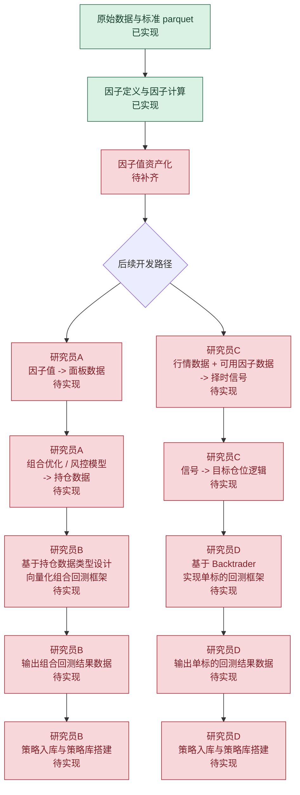

# 工作流任务清单

这份文档不再描述完整背景，而是只回答一个问题：

从当前仓库状态出发，接下来还需要完成哪些任务，任务如何沿工作流往下传递，分别由谁负责。

## 1. 当前进度边界

当前仓库可以视为已经基本完成了下面这段主链：

原始数据
→ 标准化 parquet 数据目录
→ 因子定义与计算
→ 单因子评估

也就是说，当前比较稳定的上游产出可以理解为：

- 可用的数据目录。
- 可运行的因子定义与因子计算能力。
- 可继续沉淀成标准文件的因子值结果。

从这里往后，后续开发建议分成两条路径：

- 多因子投资组合路径。
- 单标的择时路径。

## 2. 任务流流程图

## 3. 公共前置任务

这部分不是单独某个人的终局任务，而是两条路径都要共享的接口层。

| 任务 | 当前状态 | 输入 | 输出 | 备注 |
| --- | --- | --- | --- | --- |
| 因子值资产化 | 待补齐 | 因子定义、数据目录、Factor Engine 计算结果 | 标准化 factor_value 文件 | 当前能算因子，但标准化落盘层还没有完全统一 |
| 目标持仓 / 目标仓位文件格式冻结 | 待实现 | 团队对多因子和单标的回测接口需求 | 持仓 / 仓位 schema 文档 | 多因子和单标的都不要跳过这一步 |
| 回测结果文件格式冻结 | 待实现 | 回测层和分析层需求 | returns、metrics、summary 等标准文件约定 | 建议两条路径统一结果口径 |
| 策略入库规范与策略库 schema 冻结 | 待实现 | 策略定义、回测结果字段、团队检索需求 | strategy schema 文档、策略库字段约定 | 研究员 B 和研究员 D 需要共用这一套入库标准 |

## 4. 多因子投资组合任务清单

### 4.1 研究员 A 负责的任务

| 任务 | 输入 | 输出 | 主要内容 | 备注 |
| --- | --- | --- | --- | --- |
| A-1 因子值转面板数据 | factor_value 文件 | factor_panel 数据 | 对齐 timestamp 和 instrument，处理缺失值、方向统一、标准化 | 这是组合构建的第一步 |
| A-2 面板数据转组合信号 | factor_panel 数据 | composite_signal 数据 | 对多个因子做加权、排序、筛选，生成组合信号 | 第一版建议先做线性加权 |
| A-3 组合信号转持仓数据 | composite_signal 数据、组合规则、风控参数 | holdings_target 数据 | 利用组合优化与风控模型生成目标持仓数据 | 这是研究员 A 向研究员 B 的正式交付物 |

### 4.2 研究员 B 负责的任务

| 任务 | 输入 | 输出 | 主要内容 | 备注 |
| --- | --- | --- | --- | --- |
| B-1 持仓数据接口适配 | holdings_target 数据 schema | 回测输入接口 | 根据持仓数据的数据类型设计组合回测输入格式 | 要先和研究员 A 对齐 schema |
| B-2 组合回测逻辑设计 | 持仓数据、行情数据、回测配置 | 向量化回测模块 | 设计调仓、收益计算、手续费、滑点、换手等逻辑 | 第一版建议以向量化批处理实现为主 |
| B-3 组合回测结果输出 | 回测模块运行结果 | returns、metrics、summary、可选 attribution | 输出组合回测结果数据 | 结果文件格式尽量与单标的路径统一 |
| B-4 组合策略入库与策略库搭建 | 策略定义、持仓数据、回测结果数据 | strategy_registry、strategy_library | 设计组合策略的入库结构，完成策略登记、版本管理、结果挂接和策略库搭建 | 不只是保存结果，还要能支持后续检索、复跑和扩展 |

### 4.3 多因子路径的任务交接关系

多因子路径最关键的交接点是：

- 研究员 A 交付持仓数据。
- 研究员 B 消费持仓数据并完成组合回测。
- 研究员 B 在回测完成后负责策略入库和组合策略库搭建。

所以这条路径里最先要冻结的接口不是回测指标，而是持仓数据格式。

## 5. 单标的择时任务清单

### 5.1 研究员 C 负责的任务

| 任务 | 输入 | 输出 | 主要内容 | 备注 |
| --- | --- | --- | --- | --- |
| C-1 行情与可用因子转信号 | 单标的行情数据、可用因子数据 | signal 数据 | 构建单标的择时信号 | 可以复用现有因子计算能力，不一定要在 Backtrader 内算 |
| C-2 信号转目标仓位逻辑 | signal 数据、状态机参数 | target_position 数据 | 实现做多 / 空仓 / 做空等目标仓位逻辑 | 这是研究员 C 向研究员 D 的正式交付物 |

### 5.2 研究员 D 负责的任务

| 任务 | 输入 | 输出 | 主要内容 | 备注 |
| --- | --- | --- | --- | --- |
| D-1 Backtrader 回测框架搭建 | 行情数据、target_position 数据、回测配置 | 可运行的单标的回测模块 | 用 Backtrader 实现执行、成交、仓位和成本仿真 | Backtrader 主要负责执行，不负责研究信号主逻辑 |
| D-2 单标的回测结果输出 | Backtrader 回测运行结果 | returns、metrics、summary | 输出单标的回测结果数据 | 建议不要只依赖 Backtrader analyzer 的默认输出 |
| D-3 单标的策略入库与策略库搭建 | 策略定义、target_position 数据、回测结果数据 | strategy_registry、strategy_library | 设计单标的策略的入库结构，完成策略登记、版本管理、结果挂接和策略库搭建 | 需要和研究员 B 共用统一的策略库标准 |

### 5.3 单标的路径的任务交接关系

单标的路径最关键的交接点是：

- 研究员 C 交付信号和目标仓位逻辑结果。
- 研究员 D 消费目标仓位结果并完成 Backtrader 执行回测。
- 研究员 D 在回测完成后负责策略入库和单标的策略库搭建。

所以单标的路径里最先要冻结的接口是 target_position 数据格式，而不是 Strategy 代码细节。

## 6. 建议的任务顺序

为了减少返工，建议按下面顺序推进：

1. 因子值资产化。
2. 持仓 / 仓位文件格式冻结。
3. 回测结果文件格式冻结。
4. 策略入库规范与策略库 schema 冻结。
5. 研究员 A 开始做因子值 -> 面板数据 -> 持仓数据。
6. 研究员 C 开始做行情 / 因子 -> 信号 -> 目标仓位。
7. 研究员 B 基于持仓数据 schema 做向量化组合回测，并补组合策略入库与策略库搭建。
8. 研究员 D 基于 target_position schema 做 Backtrader 回测框架，并补单标的策略入库与策略库搭建。

## 7. 最简单的团队理解方式

如果只用一句话概括现在的任务分工，可以这样理解：

- 上游已经基本完成“数据 + 因子”阶段。
- 多因子路径接下来由研究员 A 负责“因子到持仓”，研究员 B 负责“持仓到组合回测结果，以及组合策略入库和策略库搭建”。
- 单标的路径接下来由研究员 C 负责“行情 / 因子到信号与目标仓位”，研究员 D 负责“基于 Backtrader 的执行回测与结果输出，以及单标的策略入库和策略库搭建”。