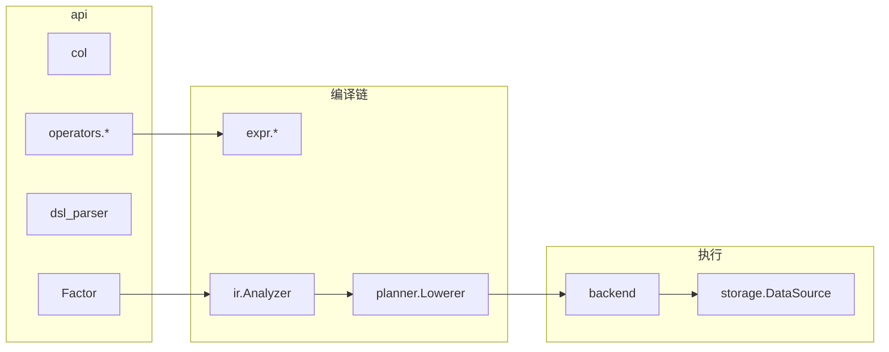

# `api` — 用户接口层（详尽说明）

本目录是 **研究员与因子引擎交互的第一层**：不直接执行数据 IO，而是提供 **列引用、因子对象、DSL 解析入口** 以及 **`operators/` 下的算子工厂**。  
下游 **`expr/`** 构造表达式树 → **`ir/`** 分析 → **`planner/`** 生成计划 → **`backend/`** 在 **`storage/`** 数据上执行 → **`runtime/FactorEngine`** 编排全流程。

### 协作者速览（约 5 分钟）

1. **你在这里能得到什么**：**`col()`**、**`Factor`**、**`parse_factor` / DSL 入口**、**`api/operators/`** 里与 DSL 同名的 **算子工厂**（构造 `Expr`，不执行 pandas）。
2. **本目录不负责什么**：**数值求值**在 **`backend/`**；**数据源**在 **`storage/`**；**一键运行**在 **`runtime/FactorEngine`**。
3. **从哪继续读**：算子白名单与语义见 **`docs/operators_semantics.md`**；注册与占位见 **`api/operator_registry.py`**；表达式节点定义在 **`expr/`**（与本目录 **`operators/`** 一一对应）。

---

## 1. 在全局架构中的位置

- **`api`** 只负责「**长什么样**」：合法的 `Expr` 树与 DSL 字符串。  
- **执行语义**（某 `op` 在 pandas 上如何实现）在 **`backend/pandas_backend.py`** 与 **`backend/kernels.py`**，不在 `api`。

---

## 2. 根目录文件逐项说明

### [`columns.py`](columns.py)

- **`col(name: str) -> ColumnRef`**：引用数据源中的一列（如 `"close"`、`"volume"`）。  
- 返回 **`expr.column.ColumnRef`**，带列名字符串；执行时由 `Analyzer` 解析为 IR 的列依赖，数据源按名拉取。

### [`factor.py`](factor.py)

- **`Factor`** 一般为 `@dataclass`：至少包含 **`name`**、**`expr`**（根节点为 `Expr`）。  
- 可选 **`freq`**、**`universe`**、**`description`**：供配置 YAML 与元数据使用，**不参与** IR 推导核心逻辑（除非后续扩展）。  
- **`FactorEngine.run(factor)`** 的入口类型即此对象。

### [`dsl_parser.py`](dsl_parser.py)

- **`parse_expr(source: str) -> Expr`**：把 **Python 表达式子集**（通过 `ast`）解析为 `Expr`。  
- **`parse_factor(...)`**：组合 `Factor` 与表达式。  
- **允许的函数名** 来自 **`operator_registry.build_dsl_allowlist()`** 的白名单；不在名单内的调用会失败。  
- **语法限制**：Python 关键字 **`and` / `or` / `not` 不能作为函数调用**，DSL 使用 **`and_`**、**`or_`**、**`not_`**（见根 `README` 与 `operators_semantics.md`）。

### [`operator_registry.py`](operator_registry.py)

- **`BrainCategory`**：枚举，用于文档/分类对齐 WorldQuant BRAIN 风格。  
- **`STUB_IR_OPS`**：**并集** 了 `vec_*` 与 `expr/fundamental|alternative|microstructure|intraday` 中声明的占位算子名；这些在 Pandas 后端可能只注册 **stub**，执行时 **`NotImplementedError`**。  
- **`build_dsl_allowlist()`**：聚合 **`api/operators`** 各子模块的工厂函数，供 **`dsl_parser`** 使用。  
- **设计原则**：华泰等外部对照的 **蛇形 DSL 名** 只维护 **一套**，见 `docs/huatai_factor_factory_operator_catalog.md`。

### [`__init__.py`](__init__.py)

- 仅导出 **常用子集**：`Factor`、`col`、`delay`、`rank`、`ts_mean`、`ts_std`/`ts_std_dev`、`zscore`。  
- **完整算子列表**请 **`from api.operators import ...`** 或 **`import api.operators`**。

---

## 3. 子包 [`operators/`](operators/README.md)

算子按 **语义分文件**（算术、时序、截面、分组、清洗、技术、上下文、变换、日内、向量、远期数据）。  
每个公开函数返回 **`expr`** 包中对应 **节点实例**；**同名**的 `Expr` 类定义在 **`expr/`** 下（非 `api` 重复实现逻辑）。

**必读扩展文档**：[`docs/operators_semantics.md`](../docs/operators_semantics.md)。

---

## 4. 典型使用方式（ mental model）

1. **手写**：`Factor(name="m", expr=rank(ts_mean(col("close"), 5)))`。  
2. **字符串**：YAML 里 `expr: rank(ts_mean(col("close"), 5))` → `parse_factor` → 同上。  
3. **禁止**：在 `api` 层直接访问 parquet；必须通过 **`FactorEngine`** + **`DataSource`**。

---

## 5. 与测试的对应关系

- DSL：`tests/test_dsl_parser.py`。  
- 算子行为：`tests/test_operators_*.py`、`tests/test_pandas_backend.py`。  
- 注册表与白名单：间接由解析与执行测试覆盖。

---

## 6. 延伸阅读

| 文档 | 内容 |
|------|------|
| [`docs/operators_semantics.md`](../docs/operators_semantics.md) | 算子语义、参数、列依赖 |
| [`expr/README.md`](../expr/README.md) | 表达式节点类 |
| [`ir/README.md`](../ir/README.md) | `Expr` → IR |
| [`runtime/README.md`](../runtime/README.md) | `FactorEngine` |
