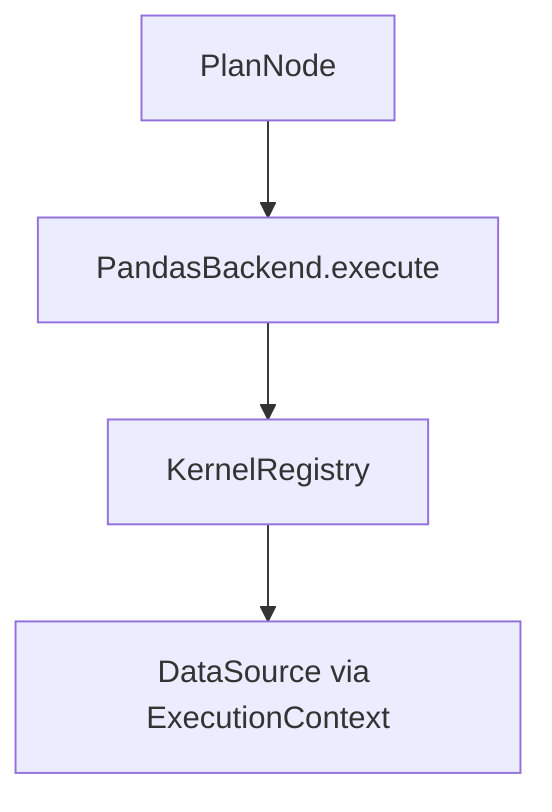

# `backend` — 执行后端（详尽说明）

本目录实现 **逻辑计划 `PlanNode` → pandas（或 Polars）Series** 的求值。  
输入不是原始 `Expr`，而是 **`planner`** 输出的 **`PlanNode`**（`op` + 有序子计划 + `attrs`）。  
**算子语义** 与 **`api/operators` 名称** 对齐，但 **实现代码** 在 **`kernels.py`** / **`pandas_backend.py`** / **`polars_backend.py`**。

### 协作者速览（约 5 分钟）

1. **本目录在干什么**：吃 **`planner`** 的 **`PlanNode`**，在 **`ExecutionContext`** 里从 **`DataSource`** 取 **MultiIndex 列**，算出 **pandas（或 Polars）Series**。
2. **主路径**：**`PandasBackend`** + **`KernelRegistry`**（`op`→可调用）；**`polars_backend`** 为子集；**`pandas_compat`** 可选 **Modin**（`FACTOR_ENGINE_USE_MODIN` 等）。
3. **性能开关**：Bottleneck / Numba 等与 **`runtime/perf_config`**、环境变量相关，详见下文文件说明。
4. **不要在这写的事**：**DSL 解析**在 `api`；**Expr 树**在 `expr`；**计划优化**在 `planner`。

---

## 1. 执行路径概览

- **`ExecutionContext`**（`backend/context.py`）携带 **`data_source`**、可选 **`cache`**、多因子时的 **`shared_result_cache`** 与 **`perf`**。  
- **列数据**：按 `Analyzer` 给出的依赖从 `DataSource` 拉取 **MultiIndex Series**（时间 × 标的）。

---

## 2. 文件逐项说明

### [`base.py`](base.py)

- 定义 **`Backend`** 抽象接口，核心方法 **`execute(plan: PlanNode, ctx: ExecutionContext)`**。  
- 具体后端需实现递归或对 `PlanNode.op` 的分派。

### [`pandas_backend.py`](pandas_backend.py)

- **主后端**：维护 **`KernelRegistry`**（`op` → Python 可调用）。  
- 对绝大多数 **`operators_semantics.md`** 中已声明的算子提供实现。  
- 处理 **MultiIndex** 对齐、缺失值、rolling 窗口等 **pandas 语义**。  
- 可选 **Bottleneck** / **Numba** 加速路径由环境变量与 `numba_kernels` 控制。

### [`polars_backend.py`](polars_backend.py)

- **子集** 算子实现；可 **`use_lazy=True`** 走 **LazyFrame**（延迟计算再 `collect`）。  
- 未覆盖的 `op` 会 **`NotImplementedError`**，与路线图一致。

### [`pandas_compat.py`](pandas_compat.py)

- 在导入 **`pandas_backend`** 使用的 `pandas` 前，可选择 **包装为 `modin.pandas`**。  
- 由环境变量 **`FACTOR_ENGINE_USE_MODIN`** 或 `factory` 的 **`pandas_modin`** 触发。  
- **注意**：Modin 与 pandas 在 **MultiIndex / rolling** 边界行为可能不同，测试见 `tests/test_pandas_compat.py`。

### [`factory.py`](factory.py)

| `backend.type`（YAML） | 构造结果 |
|------------------------|----------|
| `pandas` | `PandasBackend()` |
| `pandas_modin` | 设置 `FACTOR_ENGINE_USE_MODIN=1` 后 `PandasBackend()` |
| `polars` | `PolarsBackend()` |
| `polars_lazy` | `PolarsBackend(use_lazy=True)` |
| `debug` | `DebugBackend()` |

### [`kernels.py`](kernels.py)

- **算子名 → 函数** 注册表；大量 **lambda 或具名函数** 绑定到 pandas 操作。  
- 新增算子时通常 **同时** 改 `api/operators`、`expr`、**`kernels`**、**`operators_semantics.md`**。

### [`numba_kernels.py`](numba_kernels.py)

- 可选 **Numba JIT** 滑动窗口等；受 **`FACTOR_ENGINE_USE_NUMBA`** / **`FACTOR_ENGINE_DISABLE_NUMBA`** 等控制。

### [`debug_backend.py`](debug_backend.py)

- 打印计划树或节点信息，用于 **调试计划结构**，不做真实数值计算。

### [`context.py`](context.py)

- **`ExecutionContext`**：`data_source`、`cache`、`shared_result_cache`（`run_many` 共享子式结果）、**`perf`**（chunk、并行参数等）。

---

## 3. 与邻层契约

| 上游 | 契约 |
|------|------|
| **`planner`** | 输入必须是 **优化后的 `PlanNode`**，`op` 字符串与 `kernels` 键一致。 |
| **`storage`** | `DataSource` 必须能按列名返回对齐后的 **MultiIndex** 数据。 |
| **`ir`** | `op` 来自 IR，与 Expr 工厂一致。 |

---

## 4. 环境变量（摘录，完整见 `runtime/perf_config.py` 与各文件 docstring）

- **`FACTOR_ENGINE_USE_MODIN`**、**`FACTOR_ENGINE_DISABLE_BOTTLENECK`**、**`FACTOR_ENGINE_POLARS_LAZY`** 等。  
- 具体以源码与环境为准。

---

## 5. 测试与延伸阅读

- `tests/test_pandas_backend.py`、`tests/test_polars_backend.py`、`tests/test_pandas_compat.py`。  
- [`docs/operators_semantics.md`](../docs/operators_semantics.md)  
- [`planner/README.md`](../planner/README.md)  
- [`storage/README.md`](../storage/README.md)  
